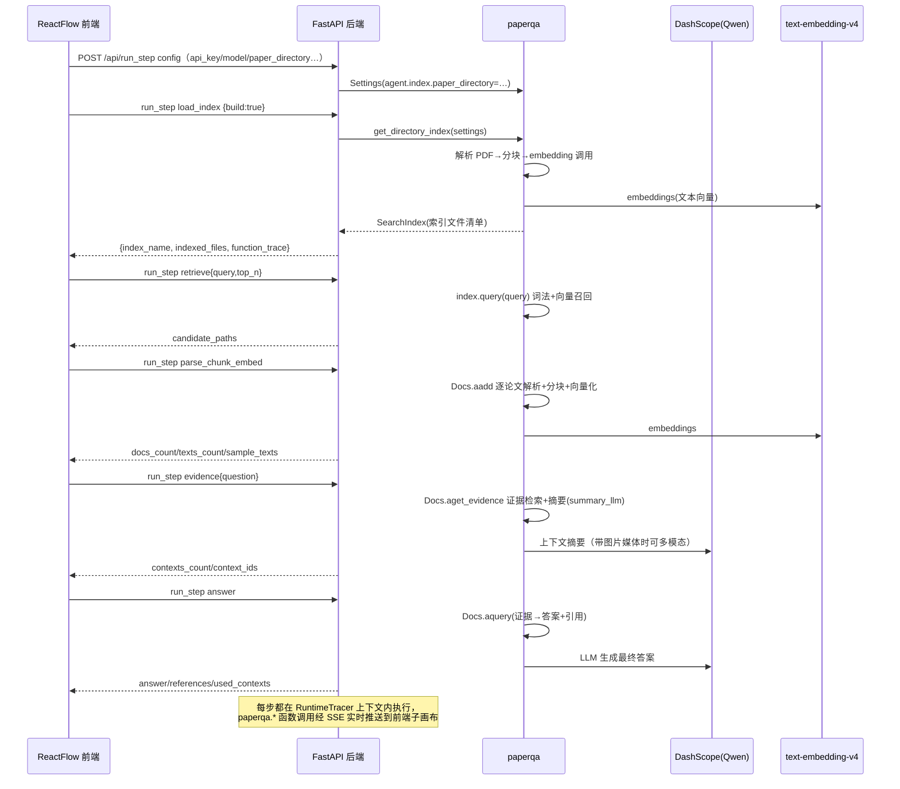

# PaperReading 代码库架构总览与文件说明（macOS 版）

> 本文档基于对 `PaperReading-MAC` 文件夹全部源码的通读与在 Windows 上对原代码的模拟运行验证编写。
> 分支：`mac`；远程：`https://github.com/PaperStrange/PaperReadingAgent.git`
> 项目原始部署位置（macOS）：`/Volumes/Extreme SSD/vscode_projects/PaperReading`

---

## 1. 项目是什么

这是一个基于 **PaperQA2**（FutureHouse 出品，vendored 源码版本 `2026.1.6.dev10+g36348d0ca`）的**论文问答可视化原型**：

- 用户把论文 PDF 放入 `data/pdf/`，GUI 对其建立全文+向量索引；
- 通过一个 6 节点的流水线 GUI（ReactFlow）逐节点可视化执行：
  `config（配置）→ load_index（建索引）→ retrieve（检索候选）→ parse_chunk_embed（解析/分块/向量化）→ evidence（证据摘要）→ answer（生成答案）`；
- 每个节点都可单步运行、查看输入/输出快照；并展示**函数级运行时追踪图**（被调用的 paperqa 内部函数、调用关系、耗时、参数/返回值摘要、PDF 页码预览图）；
- 另有 Streamlit 调试 UI（索引构建、透明流程/Agent 流程问答、运行时追踪图、日志）；
- CLI 脚本（`manual_index_paper.py`、`python_qa.py`）用于命令行验证；
- `src/` 下为学术语料采集脚本（ACL/ICLR/NeurIPS），与 GUI 无关的独立工具链。

**与描述不符之处（以实际代码为准）**：代码中没有独立的"PDF 上传+总结摘要+浏览器内句子划线高亮"界面。实际能力是：论文放入目录后由流水线完成索引与问答；"句子级"内容以 **chunk（分块）文本 + 函数追踪中的 PDF 页码预览图** 形式展示（`FunctionTraceNode` 可查看完整文本、翻译、页码图），并非在 PDF 上划线高亮。

---

## 2. 架构图

### 2.1 总体分层架构（Mermaid）

```mermaid
graph TD
    subgraph BROWSER["浏览器（GUI）"]
        V["Vite 前端 :5173<br/>React + ReactFlow"]
        M["主画布：6 个流水线节点"]
        F["函数子画布：单步调用图"]
        L["执行日志面板"]
    end

    subgraph API["FastAPI 后端 :8787（backend/main.py）"]
        R["/api/run_step（执行单步）"]
        S["/api/stream/{sid}/{run_id}（SSE 实时推送函数追踪）"]
        N["/api/new_session | /api/reset_session"]
        T["/api/translate_preview（文本翻译）"]
        ST["SessionState：进程内存会话状态"]
        BK["RunEventBroker：事件历史+订阅者"]
    end

    subgraph CORE["paperqa 核心（vendored，PaperQA2）"]
        IDX["agents.search.get_directory_index<br/>→ SearchIndex（Tantivy 全文索引）"]
        ADD["docs.Docs.aadd：<br/>解析→分块→向量化→入索引"]
        EVD["docs.Docs.aget_evidence：<br/>检索相关片段→LLM 摘要沉淀证据"]
        ANS["docs.Docs.aquery：<br/>基于证据生成答案+引用"]
        AGT["agents.main.agent_query：<br/>fake / ToolSelector / ldp 三档 Agent"]
        RD["readers：paperqa_pymupdf / paperqa_pypdf<br/>文本、图片媒体、表格/公式"]
        TR["paper-qa-script/runtime_trace.py<br/>运行时函数级追踪器（monkey-patch）"]
    end

    subgraph MODELS["模型与向量"]
        LLM["LLM：openai/qwen-omni-turbo（macOS）<br/>直达 DashScope OpenAI 兼容端点"]
        EMB["Vector：openai/text-embedding-v4（DashScope）<br/>batch_size=10"]
    end

    subgraph DATA["数据与存储"]
        PDF["data/pdf/ 论文 PDF"]
        IDXD["~/.pqa/indexes/&lt;name&gt;/<br/>Tantivy 索引 + docs/*.zip 文档归档"]
        STREAM["/api/stream SSE"]
    end

    V --> API
    M -->|http POST run_step| R
    F -->|EventSource| S
    S -->|function_trace 事件| F
    R --> ST
    ST --> CORE
    R -.用 RuntimeTracer 包裹执行.-> TR
    TR -. 包装 paperqa.* 内部函数 .-> CORE
    IDX --> IDXD
    ADD --> PDF
    ADD --> EMB
    EVD --> LLM
    ANS --> LLM
    AGT --> LLM
    RD --> PDF
    LLM --> MODELS
    EMB --> MODELS
```

### 2.2 一次问答的数据流（透明流水线）



---

## 3. 文件清单与作用

### 3.1 根目录（macOS 部署路径 `/Volumes/Extreme SSD/vscode_projects/PaperReading`）

| 路径 | 作用 |
|---|---|
| `paper-qa/` | **vendored PaperQA2 源码仓库**（github.com/Future-House/paper-qa @ 36348d0ca），包含 `src/paperqa` 核心包、`packages/paper-qa-{pypdf,pymupdf,docling,nemotron}` reader 子包、`tests/`、`docs/`、`uv.lock`。Python ≥3.11，实际运行环境为 3.13。 |
| `paper-qa-script/` | **本项目自研脚本**（下文详述），是 GUI/追踪器/命令行工具的所在地。 |
| `src/` | 语料采集脚本（`collect_acl.py`、`collect_iclr_openreview.py`、`collect_neurips_proceedings.py`），把 ACL/ICLR/NeurIPS 论文元数据+摘要+intro 归一化为 jsonl。 |
| `data/pdf/` | 论文 PDF（示例 `PaperQA2.pdf`，arXiv:2409.13740，25 页）。 |
| `data/parsed/` | 采集脚本产出的语料 jsonl（`papers_acl.jsonl` 等，未入库）。 |
| `requirements.txt` | 语料采集脚本依赖（acl-anthology、openreview-py、pandas、pypdf 等），**与 GUI 无关**。 |
| `example_papers.jsonl` | 语料格式示例。 |
| `工程目录结构.txt` | 早期项目结构草稿（dapt_survey 相关，已过时，仅参考）。 |
| `常用sh命令合集.txt` | macOS 部署/运行命令备忘。 |
| `此项目python环境在.venv目录中.txt` | 空占位说明（python 环境在 `paper-qa/.venv`）。 |
| `tmp.log` | 一次 macOS 命令行 Q&A 会话日志（含 ToolSelector 全部 status=fail 的记录与 Mojibake 乱码输入问题）。 |

### 3.2 `paper-qa-script/`

| 文件 | 作用 |
|---|---|
| `reactflow-paperqa-prototype/README.md` | 原型说明（macOS 路径写法的运行命令）。 |
| `reactflow-paperqa-prototype/backend/main.py` | **FastAPI 后端**（端口 8787）。`StepRequest/StepResponse` 驱动 6 个步骤；`SessionState` 内存态；`RunEventBroker` 支持 SSE 订阅；`build_settings` 组装 paperqa `Settings`（LLM=openai/qwen-omni-turbo、embedding=openai/text-embedding-v4、api_base=阿里百炼 DashScope OpenAI 兼容模式、enrichment 同 LLM）；每步包在 `RuntimeTracer` 里执行并将 `function_trace` 事件经 SSE 广播；`/api/translate_preview` 用主 LLM 做中译英。 |
| `reactflow-paperqa-prototype/backend/requirements.txt` | fastapi/uvicorn/pydantic。 |
| `reactflow-paperqa-prototype/frontend/` | React 18 + Vite 5 + ReactFlow 11 前端。`App.jsx`（主控制：节点编辑、REST+SSE、函数子图布局算法）、`FlowNode.jsx`（步骤节点卡片：参数 JSON 编辑、Run/Run Upstream/Run From Here、快照、trace 列表）、`FunctionTraceNode.jsx`（函数节点卡片：文本全文/中文翻译按钮/图片预览）、`JsonTree.jsx`、`api.js`、`styles.css`。 |
| `runtime_trace.py` | **运行时追踪器**：monkey-patch `paperqa.*` 的指定函数（`TARGETS`）与若干模块中的所有函数（`MODULE_TARGETS`），为每次调用记录 call_id/parent_call_id/depth/task_id/耗时/参数摘要（脱敏）/返回值摘要；针对 `_make_chunk` 额外提取文本全文与 **PDF 页码预览图**（PyMuPDF 渲染页面→base64），并把函数调用层级还原成调用树。 |
| `streamlit_paperqa_app.py` | Streamlit 调试 UI（8501）：侧边栏配置、索引构建、透明流水线/Agent 流程问答、节点明细、运行时追踪聚合图/时序图（graphviz DOT→SVG/PNG 下载）、会话日志（SessionLogHandler 捕获 root logger）。 |
| `manual_index_paper.py` | CLI：构建索引→校验→交互式提问（agent_query 默认 ToolSelector）。**硬编码 macOS 路径**（paper_dir=/Volumes/…/data/pdf，index_dir=/Users/zhangheli/.pqa/indexes/debug_index）。 |
| `python_qa.py` | CLI 简化脚本：`ask()` 一次性提问（qwen3-max）。同样硬编码 macOS 路径。 |
| `manual_test_internet_connection.py` | litellm 直连测试脚本（qwen3-max@DashScope）。 |
| `settings_tutorial.py` | 一行实验脚本（打印 `CommonLLMNames`）。 |
| `analyze_paperqa_system.py` / `count_paperqa_functions.py` | 静态 AST 分析工具：统计 paperqa 函数、导出 `paperqa_function_inventory.json`/`paperqa_function_interfaces.json`/`paperqa_callgraph.json`/`paperqa_system_report.md`。**硬编码 macOS 路径**。 |
| `paperqa_system_report.md` | 上述工具产出：371 个函数、入口函数签名、近似调用路径（静态 AST）。 |
| `.env` | bash 风格密钥文件（旧 OpenAI sk-proj-* 与 DashScope key，均已失效）。 |

### 3.3 `paper-qa/src/paperqa/` 核心模块速览

| 模块 | 职责 |
|---|---|
| `agents/main.py` | `agent_query()`/`run_agent()`：fake/ToolSelector(aviary)/ldp 三种 Agent；`DEFAULT_AGENT_TYPE`；答案写入 `answers` 索引。 |
| `agents/search.py` | `get_directory_index()` + `SearchIndex`（Tantivy）：目录文件→文档→分块→向量化→全文索引；`docs/*.zip` 归档；`~/.pqa/indexes/<name>/`。 |
| `agents/tools.py` | Agent 工具：PaperSearch、context 工具、answer 工具等。 |
| `docs.py` | `Docs`：`aadd`（解析/引用/向量化）、`aget_evidence`（证据+摘要）、`aquery`（答案）、`aadd_texts`、`retrieve_texts`。 |
| `readers.py` | `read_doc` 分发：pdf/txt/html/md/office/图片；`_make_chunk` 等分块函数。 |
| `settings.py` | `Settings`（llm/llm_config/summary_llm/embedding/parsing/agent 等）、`IndexSettings`（index_directory 默认 `~/.pqa/indexes`）、`ParsingSettings`（multimodal 默认 ON_WITH_ENRICHMENT）、`AgentSettings`。 |
| `llms.py` / `core.py` | LLM/向量化封装；并行的证据摘要 map 等。 |
| `paths.py` | `PAPERQA_DIR = ~/.paperqa`（历史；实际索引目录见 utils.pqa_directory：`~/.pqa`）。 |
| `utils.py` | `pqa_directory()`（`~/.pqa/<name>`，支持 `PQA_HOME` 覆盖）、md5、脱敏等。 |
| `clients/` | Crossref/OpenAlex/SemanticScholar/Unpaywall/Retractions 元数据客户端。 |
| `configs/*.json` | 内置设置档（debug/fast/high_quality/openreview/tier1-5 等）。 |

---

## 4. 关键机制与约定

1. **索引目录**：`~/.pqa/indexes/<index_name>/`（`$HOME/.pqa`；可用 `PQA_HOME` 覆盖）。macOS 上即 `/Users/zhangheli/.pqa`。索引内容包括 Tantivy 索引段、`docs/` 下按 filehash 命名的文档存档（默认 pickle+zlib `.zip`）、`files.zip` 清单。
2. **模型配置**：所有 LLM 配置集中在 `build_settings()`（后端/Streamlit 各一份）与各 CLI 脚本的 `llm_config/embedding_config` 字典中。macOS 使用 `openai/qwen-omni-turbo` + `openai/text-embedding-v4`，经 litellm 的 `model_list` + `litellm_params`（model/api_base/api_key）直连 DashScope OpenAI 兼容端点。`OPENAI_API_KEY` 环境变量同样被写入。
3. **RuntimeTracer 调用栈**：基于 `contextvars.ContextVar` 在同步/异步包装器间传递调用栈（call_id 链、depth），任务 ID 用 `asyncio.current_task().id()`；`on_event` 回调供后端 SSE 实时推送。
4. **前端函数子图**：从前端接收的 `function_trace` 按 `parent_call_id` 构建树，深度优先布局（列数按画布宽 860 折算），每个函数一张卡片，可展开查看 args/result 载荷与 PDF 页码预览。
5. **会话语义**：后端内存态，重启即清空；`run_id` 由前端生成（时间戳+随机）；点击 `New Session` 生成新 session_id。

---

## 5. 已知问题与注意事项（macOS 基线）

- **Agent(ToolSelector) 在 macOS 上表现为 status=fail**：`tmp.log` 显示每次 ToolSelector 问答最终 `MalformedMessageError`（Qwen 未按工具调用格式返回）。可切换 `Agent 模式=fake`（稳定）或使用"透明流程"（推荐）。
- **终端乱码**：`tmp.log` 中问题文本以 GBK/UTF-8 混码（如"鐢ㄤ腑鏂囧洖绛斾竴涓?"），是终端编码问题，非代码问题。
- **`runtime_trace.py` 的 staticmethod 修补缺陷**（原文件 bug，模拟运行时发现并已修复，见 `docs/02-运行与验证记录.md`）：错误地把 `@staticmethod`（如 `SearchIndex.filehash`）替换为普通函数，经实例调用会多传 `self` 导致 `TypeError`，使带追踪的 load_index 失败。
- 硬编码 macOS 路径散布在：后端 README、Streamlit 默认目录、`App.jsx` config 默认 `paper_directory`、`manual_index_paper.py`、`python_qa.py`、`analyze_paperqa_system.py`、`count_paperqa_functions.py`。Windows 移植版已全部改为可移植写法（见 Windows 仓库文档）。
