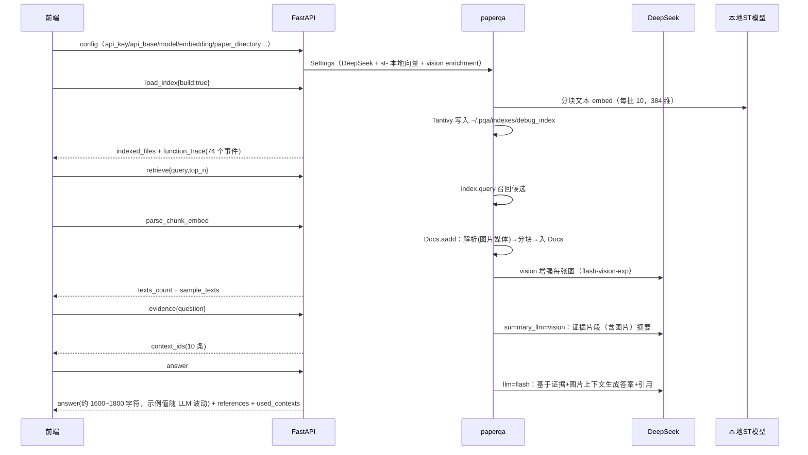

# 2-ARCHITECTURE —— 项目架构

> 适用于 `PaperReading-Windows`。运行/规范见 `1-WORKFLOW.MD`，经验教训见 `3-LEARNED.MD`。
> 本文件回答：系统由哪些部分组成、各文件职责、数据如何流转、模型与存储如何配置。

---

## 1. 项目是什么

基于 **PaperQA2**（FutureHouse，vendored 源码 `2026.1.6.dev10+g36348d0ca`）的**论文问答可视化原型**：

- 论文 PDF 放入 `data/pdf/`，GUI 建立**全文 + 向量索引**（Tantivy）；
- ReactFlow 前端按 6 节点流水线可视化执行：`config → load_index → retrieve → parse_chunk_embed → evidence → answer`；
- 每个节点可单步执行、查看输入/输出快照、查看**函数级运行时追踪图**（调用树 + 耗时 + 参数/返回值 + PDF 页码预览）；
- 另有 Streamlit 调试 UI 与 CLI 脚本；`src/` 为学术语料采集（ACL/ICLR/NeurIPS，独立工具链）。

**功能边界（以实际代码为准）**：没有"PDF 上传 + 摘要 + 浏览器内句子划线高亮"界面；"句子级"内容以
chunk 文本 + 函数追踪卡片中的完整文本/中文翻译/页码预览图（PyMuPDF 渲染）呈现。

## 2. 总体架构（Mermaid）

```mermaid
graph TD
    subgraph BROWSER["浏览器 GUI"]
        V["ReactFlow 前端（Vite :5173）"]
        MS["主画布：6 流水线节点<br/>Run Node / Run Upstream / Run From Here / Run All"]
        FS["函数子画布：按步骤的调用图<br/>（按 parent_call_id 还原调用树）"]
        LOG["Execution Log 面板"]
    end
    subgraph API["FastAPI 后端 :8787（backend/main.py）"]
        RS["/api/run_step：6 步<br/>config/load_index/retrieve/parse_chunk_embed/evidence/answer"]
        SS["/api/stream/{sid}/{run_id}：SSE 实时函数追踪"]
        NS["/api/new_session / reset_session / session_records"]
        TP["/api/translate_preview：中文翻译"]
        ST["SessionState（进程内存）"]
        BK["RunEventBroker（历史 + 订阅队列）"]
    end
    subgraph CORE["paperqa 核心（vendored）"]
        IDX["get_directory_index → SearchIndex<br/>Tantivy 全文索引 ~/.pqa/indexes/&lt;name&gt;/"]
        ADD["Docs.aadd：解析→分块→embedding→入索引"]
        EV["Docs.aget_evidence：召回→证据摘要(summary_llm 支持图片)"]
        AN["Docs.aquery：答案 + 引用"]
        AG["agent_query/run_agent：fake / ToolSelector / ldp"]
        RD["readers：paperqa_pymupdf（默认）/ paperqa_pypdf<br/>文本、图片媒体、公式/表格"]
        TR["runtime_trace.py：函数级追踪器（monkey-patch）"]
    end
    subgraph MODELS["AI 服务（Windows 默认）"]
        LLM["DeepSeek API：https://api.deepseek.com<br/>openai/deepseek-v4-flash：问答/引用生成"]
        VLLM["openai/deepseek-v4-flash-vision-exp：<br/>图片增强 enrichment + 证据摘要"]
        EMB["本地 sentence-transformers<br/>st-multi-qa-MiniLM-L6-cos-v1（384 维，无 API key）"]
    end
    subgraph DATA["数据"]
        PDF["data/pdf/ 论文 PDF"]
        IDXD["~/.pqa/indexes/&lt;name&gt;：Tantivy 索引段 + docs/*.zip"]
    end
    V --> API
    MS -->|POST run_step| RS
    FS -->|EventSource| SS
    SS -.function_trace 事件.-> FS
    RS --> ST --> CORE
    RS -.RuntimeTracer 上下文.-> TR
    TR -.包装 paperqa.* 函数.-> CORE
    IDX --> IDXD
    ADD --> PDF
    LLM --> MODELS
    VLLM --> MODELS
    EMB --> MODELS
```

### 一次完整问答（透明流水线，已实测通过）



## 3. 目录结构

```
PaperReading-Windows/
├── .venv/                     # Python 3.13 虚拟环境（不入库）
├── paper-qa/                  # vendored PaperQA2（与 mac 版一致，未改动）
├── paper-qa-script/
│   ├── streamlit_paperqa_app.py       # Streamlit 调试 UI（已适配）
│   ├── runtime_trace.py               # 函数级追踪器（已修复 staticmethod 缺陷）
│   ├── manual_index_paper.py          # CLI：建索引+交互问答（已适配）
│   ├── python_qa.py                   # CLI：ask() 一次性问答（已适配）
│   ├── manual_test_internet_connection.py  # DeepSeek 连通性测试（已适配）
│   ├── settings_tutorial.py           # 一行实验脚本
│   ├── analyze_paperqa_system.py      # 静态 AST 分析（路径已改相对）
│   ├── count_paperqa_functions.py
│   ├── paperqa_system_report.md       # 分析产物（371 函数）
│   ├── .env                            # PAPERQA_PROVIDER + 服务商 key（旧 key 注释保留）
│   ├── provider_config.py              # 服务商注册表（内置 4 家 + providers.json/环境变量自定义；PAPERQA_PROVIDER 切换）
│   ├── app/                            # Sprint-2/3 分层（UI → API → 编排 → 引擎适配 → 基础设施）
│   │   ├── orchestration.py            # 编排层：PipelineOrchestrator（六步流水线 + StepRequest/Response + embed 缓存）
│   │   ├── engine.py                   # 引擎适配层：EngineAdapter 接口 + LocalVendorAdapter（paperqa 透传）
│   │   ├── config_schema.py            # 配置唯一真源：策展 schema + validate_config + CLI 生成 config_schema.json
│   │   ├── events.py                   # 统一事件模型（StepEvent/FunctionTraceEvent/…，SSE 线协议兼容）
│   │   ├── session_store.py            # 基础设施：SessionStore 接口 + MemorySessionStore（含会话级数据源参数）
│   │   ├── data_sources.py             # 数据源领域模型（SourceKind/SourceSpec/RemoteSourceConfig，纯校验无 IO）
│   │   └── remote_resolver.py          # 远程源解析器（arXiv API/Unpaywall DOI/直链 → data/remote/<index_name>/ 暂存）
│   └── reactflow-paperqa-prototype/
│       ├── backend/main.py             # FastAPI 路由层（Sprint-2 解耦后：8 条 API 路由 + RunEventBroker/SSE + 组合根）
│       ├── backend/requirements.txt
│       └── frontend/                   # React+Vite（App.jsx / FlowNode.jsx / ModelConfigPanel.jsx / DataSourcePanel.jsx / FunctionTraceNode.jsx / JsonTree.jsx）
├── src/                       # ACL/ICLR/NeurIPS 语料采集
├── data/pdf/PaperQA2.pdf      # 示例论文
├── data/remote/               # Sprint-3 远程源下载暂存（.gitignore 忽略，运行时生成）
├── scripts/                   # setup-env.ps1 / start-backend.ps1 / start-frontend.ps1 / start-streamlit.ps1（+ .bat 双击版）
├── verify/                    # 验收脚本（smoke/e2e/agent/provider_switch/embed_load/remote_e2e + gui_check*.mjs）+ e2e 结果
├── requirements-windows.txt   # Windows 依赖清单
├── requirements.txt           # 原语料采集依赖（未动）
├── docs/                      # 1-WORKFLOW / 2-ARCHITECTURE / 3-LEARNED
└── README.md                  # 入口
```

## 4. 文件级职责

- **backend/main.py**（路由层，Sprint-2 US-2.2 解耦后 ~186 行）：FastAPI app + CORS、8 条 API 路由（Sprint-4 新增 `GET /api/providers` 脱敏注册表）、`RunEventBroker`/SSE 传输（历史 500 条/键）、组合根（`SESSIONS`=MemorySessionStore、`ORCHESTRATOR`=make_orchestrator）；`build_settings()` 保留为 `ENGINE.make_settings` 薄包装（模型配置真源在 `app/engine.py` + `provider_config.py`）。
- **app/orchestration.py**（编排层）：`PipelineOrchestrator.run_step`——六步流水线（config→load_index→retrieve→parse_chunk_embed→evidence→answer）、`StepRequest/StepResponse`、embed 缓存、`RuntimeTracer(on_event=…)` 接线；实时事件经 `on_event` 回调交路由层发布（SSE 消息由 `app/events` 模型构造，线协议兼容）。**Sprint-4 增量**：config 步骤 embedding 推荐注入；load_index 的目录存在检查与**索引自愈**（files.zip 前置 zlib 试解压，坏则删、build=true 重建）。
- **app/engine.py**（引擎适配层）：`EngineAdapter` 接口（config/index/query/add_doc/evidence/answer/run_agent/version）+ `LocalVendorAdapter` 透传现有 paperqa 调用；`make_settings` 含密钥优先级（显式→专属→通用）、**Windows `\\?\` 长路径前缀（UNC 转 `\\?\UNC\`）**、隐藏目录过滤、`recurse_subdirectories` 参数。
- **app/config_schema.py**（配置唯一真源）：策展七组 schema（LLM/Embedding/Parsing/Agent/Answer/数据源/Index）+ 从 `Settings.model_fields` 自动提取默认值 + `validate_config`（errors/warnings/hints）；`python -m app.config_schema` 生成 `config_schema.json`。
- **app/events.py / app/session_store.py**：统一事件模型（StepEvent/FunctionTraceEvent/AgentActionEvent/…）；`SessionStore` 接口 + `MemorySessionStore`。
- **app/data_sources.py / app/remote_resolver.py**（Sprint-3 主题 B）：数据源领域模型与远程源解析——`data_source` 模式（local 默认 / remote 下载暂存）；URL/arXiv/DOI 经 `resolve_remote_sources` 统一下载到 `data/remote/<index_name>/`（幂等、逐源失败明细），复用现有索引/解析管线；`manifest_file` 元数据增强生效。**安全**：下载前 SSRF 校验（仅公网 http/https、拒绝内网/本机地址、重定向逐跳复检）、单文件 200MB 上限 + 流式临时文件；编排层对 `input_snapshot`/`run_records` 做 api_key 脱敏。
- **App.jsx**（1000+ 行）：节点状态机（idle/running/success/failed/stale）；`runSingleNode`（EventSource 收流 + POST）；上下游拓扑（`getUpstreamIds/getDownstreamIds`）；`buildFunctionSubgraphForStep`（调用树布局：深度分组、列宽 340、软碰撞避让、最多 140 调用）；`runAllSequential`。
- **FlowNode.jsx / ModelConfigPanel.jsx / DataSourcePanel.jsx / FunctionTraceNode.jsx / JsonTree.jsx**：步骤节点卡片（参数 JSON 编辑——本地草稿态防光标跳、Run/Run Upstream/Run From Here、快照、trace 列表）；Config 节点「模型配置」面板（provider 下拉联动 /api/providers 自动带出 api_base/model/vision/embedding）+「数据源」切换面板（local/remote、URL/arXiv/DOI 列表、manifest 路径）；函数节点卡片（文本全文/中文翻译按钮/图片预览）；JSON 树渲染。**样式规范（Sprint-4）**：节点内 block 标题一律 `.node-block-title`、字段标签一律 `.ds-label`、说明文字 `.ds-sub/.ds-hint`，新面板必须复用。
- **runtime_trace.py**：`RuntimeTracer`（19 个显式 TARGETS + 8 个 MODULE_TARGETS 全量函数 + 可选 lmi embed）；上下文栈基于 contextvars；`_make_chunk` 的 result 载荷含 text_full/text_preview/media 信息/页码预览（fitz 渲染，0.45 缩放，≤400KB）。
- **streamlit_paperqa_app.py**：`SessionLogHandler`、`_reset_litellm_logging_worker`（修复跨 event loop 队列问题）、`run_coro`、透明流水线（5 节点计时）、DOT 生成与 graphviz 渲染/下载。

## 5. 默认模型与密钥（Windows）

| 用途 | macOS 原版 | Windows 移植版 |
|---|---|---|
| 主 LLM（答案/引用） | `openai/qwen-omni-turbo` | `openai/deepseek-v4-flash` |
| 证据摘要 summary_llm | 同上（支持图片） | `openai/deepseek-v4-flash-vision-exp`（证据上下文可能含图片，文本模型会报 `does not support image`） |
| 图片/图表增强 enrichment_llm | 同上 | `openai/deepseek-v4-flash-vision-exp` |
| 向量化 | `openai/text-embedding-v4`（API） | `st-multi-qa-MiniLM-L6-cos-v1`（本地，首次自动下载 ~90MB） |
| API Base | `https://dashscope.aliyuncs.com/compatible-mode/v1` | `https://api.deepseek.com` |
| 思考模式 | 不适用 | `extra_body={"thinking":{"type":"disabled"}}` 关闭（详见 3-LEARNED） |

密钥解析优先级：config 节点 `params.api_key` → 服务商专属环境变量（`DEEPSEEK_API_KEY` / `DASHSCOPE_API_KEY` / `OPENAI_API_KEY` / `OPENROUTER_API_KEY`）→ 通用 `OPENAI_API_KEY` → 本地 `paper-qa-script/.env`（ps1 启动脚本导入）；服务商由 `PAPERQA_PROVIDER` 切换（内置 4 家 + `providers.json`/`PAPERQA_PROVIDERS_JSON` 自定义），显式 `api_base/model/vision_model/embedding_model` 参数优先级最高。

## 6. 数据与存储约定

- 索引目录：`%USERPROFILE%\.pqa\indexes\<name>\`（`PQA_HOME` 可覆盖）；mac 版为 `~/.pqa/indexes`（同一代码路径；Mermaid 图中简写为 `~/.pqa/indexes`）。
- 远程源暂存：`data/remote/<index_name>/`（.gitignore 忽略；remote 模式下即 `paper_directory`，下载→索引→解析全流程复用本地管线）。
- 前端只读后端返回的 JSON 快照；会话/索引在后端与磁盘；重启后端会话丢失、索引保留（`load_index{build:false}` 复用）。
- `data/parsed/*.jsonl`（语料）不入库；`data/pdf/PaperQA2.pdf` 入库用于演示。
