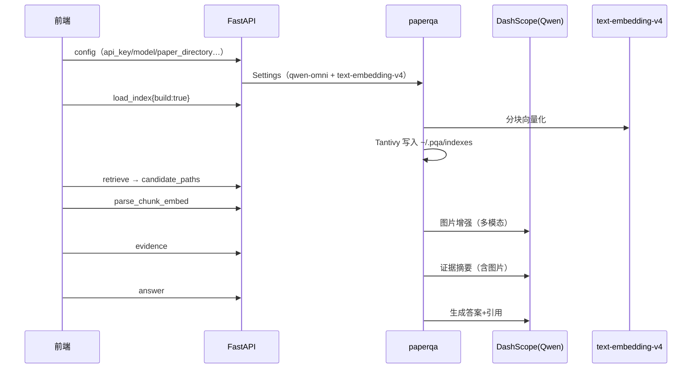

# 2-ARCHITECTURE —— 项目架构（macOS 版）

> 适用于 `PaperReading-MAC`。运行/规范见 `1-WORKFLOW.MD`，经验教训见 `3-LEARNED.MD`。

---

## 1. 项目是什么

基于 **PaperQA2**（FutureHouse，vendored 源码 `2026.1.6.dev10+g36348d0ca`）的**论文问答可视化原型**：
论文 PDF 放入 `data/pdf/`，GUI 按 6 节点流水线（config → load_index → retrieve → parse_chunk_embed → evidence → answer）
建立全文+向量索引并完成带引用的上下文问答；含函数级运行时追踪、PDF 页码预览；另有 Streamlit 调试 UI 与 CLI 脚本；
`src/` 为学术语料采集（ACL/ICLR/NeurIPS，独立工具链）。

**功能边界（以实际代码为准）**：无"PDF 上传 + 摘要 + 浏览器内句子划线高亮"界面；"句子级"内容以 chunk 文本 + 追踪卡片中的页码预览图呈现。

## 2. 总体架构（Mermaid）

```mermaid
graph TD
    subgraph BROWSER["浏览器 GUI"]
        V["ReactFlow 前端（Vite :5173）"]
        MS["主画布：6 流水线节点"]
        FS["函数子画布：单步调用图"]
        LOG["执行日志面板"]
    end
    subgraph API["FastAPI 后端 :8787（backend/main.py）"]
        RS["/api/run_step：6 步"]
        SS["/api/stream/{sid}/{run_id}：SSE 实时函数追踪"]
        NS["/api/new_session | reset_session"]
        TP["/api/translate_preview"]
        ST["SessionState（进程内存）"]
        BK["RunEventBroker（历史+订阅）"]
    end
    subgraph CORE["paperqa 核心（vendored）"]
        IDX["get_directory_index → SearchIndex（Tantivy）"]
        ADD["Docs.aadd：解析→分块→向量化→入索引"]
        EV["Docs.aget_evidence：检索→摘要"]
        AN["Docs.aquery：答案+引用"]
        AG["agent_query/run_agent：fake / ToolSelector / ldp"]
        RD["readers：paperqa_pymupdf / paperqa_pypdf"]
        TR["runtime_trace.py：函数级追踪器"]
    end
    subgraph MODELS["模型（macOS）"]
        LLM["LLM：openai/qwen-omni-turbo"]
        EMB["Vector：openai/text-embedding-v4（batch 10）"]
        API["DashScope OpenAI 兼容端点<br/>https://dashscope.aliyuncs.com/compatible-mode/v1"]
    end
    subgraph DATA["数据"]
        PDF["data/pdf/ 论文 PDF"]
        IDXD["~/.pqa/indexes/&lt;name&gt;/<br/>Tantivy 索引 + docs/*.zip"]
    end
    V --> API
    MS -->|POST run_step| RS
    FS -->|EventSource| SS
    SS -.function_trace.-> FS
    RS --> ST --> CORE
    RS -.RuntimeTracer 上下文.-> TR
    TR -.包装 paperqa.* 函数.-> CORE
    IDX --> IDXD
    ADD --> PDF
    LLM --> API
    EMB --> API
```

### 一次问答数据流（透明流水线）



## 3. 目录与文件职责

```
PaperReading-MAC/
├── paper-qa/            # vendored PaperQA2（FutureHouse @36348d0ca）
│   ├── src/paperqa/     # agents / docs / readers / settings / llms / clients / configs …
│   ├── packages/        # paper-qa-{pypdf,pymupdf,docling,nemotron}
│   ├── tests/ docs/ uv.lock pyproject.toml
├── paper-qa-script/
│   ├── streamlit_paperqa_app.py      # Streamlit 调试 UI
│   ├── runtime_trace.py              # 函数级追踪器（已修复 staticmethod 缺陷）
│   ├── manual_index_paper.py         # CLI 建索引+交互问答（硬编码 mac 路径）
│   ├── python_qa.py                  # CLI ask()（硬编码 mac 路径）
│   ├── manual_test_internet_connection.py
│   ├── settings_tutorial.py
│   ├── analyze_paperqa_system.py / count_paperqa_functions.py  # 静态 AST 分析
│   ├── paperqa_system_report.md      # 371 函数清单
│   ├── .env                          # bash 风格密钥（旧 key，已失效）
│   └── reactflow-paperqa-prototype/  # backend/main.py + frontend/
├── src/                 # collect_acl / collect_iclr_openreview / collect_neurips_proceedings
├── data/pdf/PaperQA2.pdf
├── data/parsed/*.jsonl  # 语料（不入库）
├── requirements.txt     # 语料采集依赖（与 GUI 无关）
└── docs/                # 1-WORKFLOW / 2-ARCHITECTURE / 3-LEARNED
```

### `paper-qa/src/paperqa/` 核心模块

| 模块 | 职责 |
|---|---|
| `agents/main.py` | `agent_query()`/`run_agent()`：fake/ToolSelector(aviary)/ldp 三种 Agent |
| `agents/search.py` | `get_directory_index()` + `SearchIndex`（Tantivy）；`docs/*.zip` 归档 |
| `agents/tools.py` | PaperSearch、context、answer 工具 |
| `docs.py` | `Docs`：aadd / aget_evidence / aquery / aadd_texts / retrieve_texts |
| `readers.py` | `read_doc` 分发（pdf/txt/html/md/office/图片）+ `_make_chunk` |
| `settings.py` | `Settings` / `IndexSettings`（默认 `~/.pqa/indexes`）/ `ParsingSettings`（multimodal 默认 ON_WITH_ENRICHMENT）/ `AgentSettings` |
| `utils.py` | `pqa_directory()`（`~/.pqa/<name>`，`PQA_HOME` 可覆盖）等 |
| `clients/` | Crossref / OpenAlex / SemanticScholar / Unpaywall / Retractions |

## 4. 关键机制

- **索引目录**：`~/.pqa/indexes/<name>/`（macOS 即 `/Users/zhangheli/.pqa`）；含 Tantivy 索引段、`docs/` 按 filehash 命名的文档存档（默认 pickle+zlib `.zip`）、`files.zip`。
- **模型配置**：集中在 `build_settings()`（后端/Streamlit）与 CLI 脚本的 `llm_config/embedding_config`；macOS 用 `openai/qwen-omni-turbo` + `openai/text-embedding-v4`，经 litellm `model_list`/`litellm_params` 直连 DashScope。
- **RuntimeTracer**：基于 contextvars 传调用栈（call_id 链/depth），`on_event` 回调供 SSE 实时推送。
- **前端函数子图**：按 `parent_call_id` 建树，深度优先布局（画布宽 860 折算），卡片可展开 args/result 与页码预览。
- **会话语义**：后端内存态，重启清空；`run_id` 由前端生成（时间戳+随机）；`New Session` 新建 session_id。

## 5. 与 Windows 版差异提要

- macOS：`openai/qwen-omni-turbo`（LLM/摘要/增强）+ `openai/text-embedding-v4`（向量化）@ DashScope。
- Windows（详见 windows 仓库 `docs/`）：DeepSeek LLM + 本地 sentence-transformers 向量化 + DeepSeek 视觉模型增强/摘要，路径可移植 + ps1 启动脚本，并同步修复了 `runtime_trace.py` 同一缺陷。
