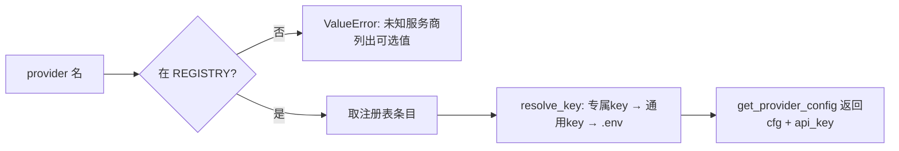
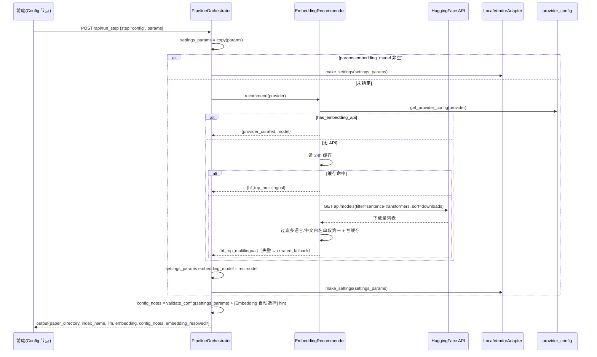
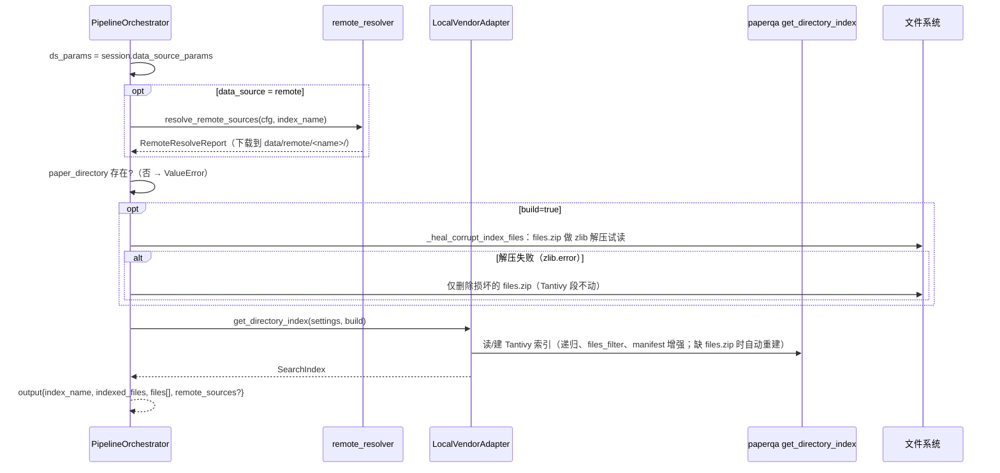
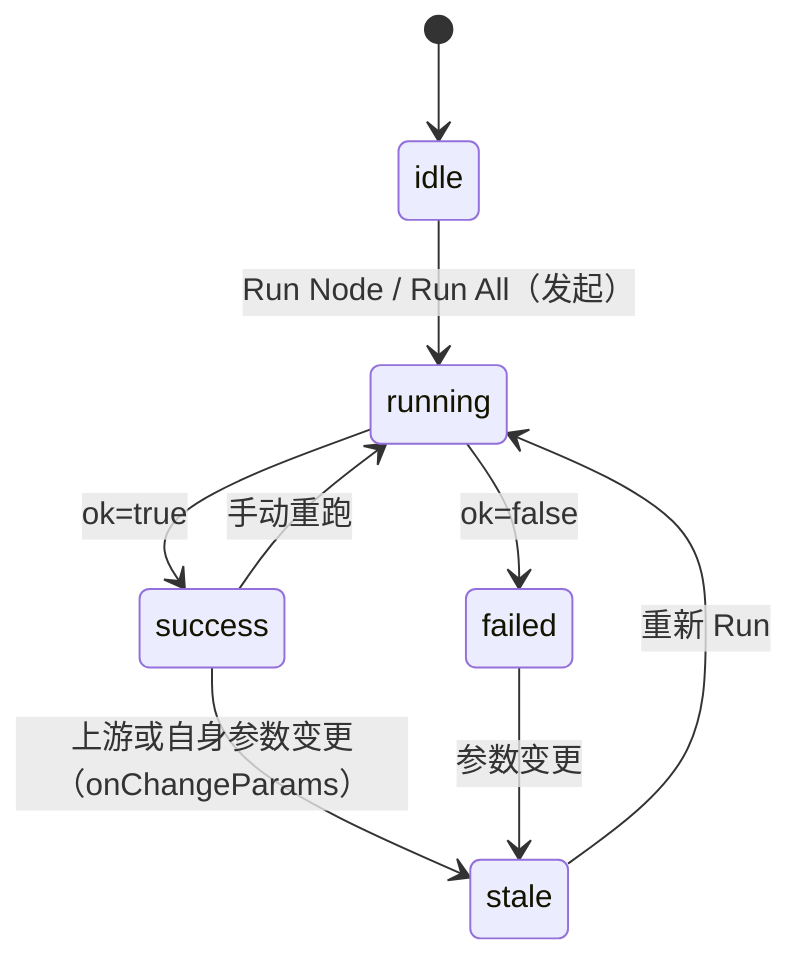
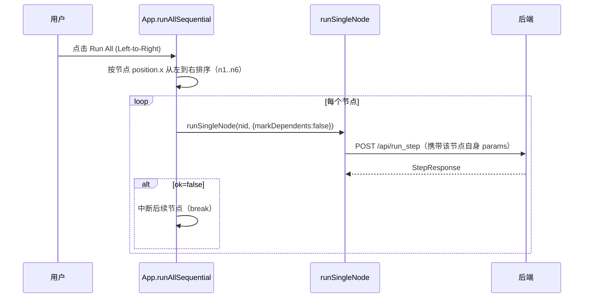

# 4-ALGORITHM.MD —— 前后端决策逻辑与算法（DSL 规则 + UML 图）

> **定位**：本文档是"决策逻辑"的唯一权威说明——`2-ARCHITECTURE.MD` 讲**结构**（模块职责/数据流），本文讲**规则**（每个决策在哪里、怎么判、按什么顺序）。
> **维护约定**：每条决策规则标注「源文件 · 函数/行号」；**代码改动后必须同步本文**（防漂移核对见 §12）。图用 Mermaid（GitHub 原生渲染）。
> 适用分支：windows（迭代）/main（同步后一致）；实现版本对应 paperqa `2026.1.6.dev10+g36348d0ca`。

## 目录

1. [DSL 约定](#1-dsl-约定)
2. [决策索引总览](#2-决策索引总览)
3. [D1 Provider 注册与解析](#3-d1-provider-注册与解析)
4. [D2 配置解析 make_settings](#4-d2-配置解析-make_settings)
5. [D3 Embedding 模型决策（含智能推荐）](#5-d3-embedding-模型决策含智能推荐)
6. [D4 数据源决策（local/remote/长路径/自愈）](#6-d4-数据源决策localremote长路径自愈)
7. [D5 配置校验与提示 validate_config](#7-d5-配置校验与提示-validate_config)
8. [D6 六步流水线：前置条件/状态/事件](#8-d6-六步流水线前置条件状态事件)
9. [D7 前端决策（节点状态机/草稿态/面板联动）](#9-d7-前端决策节点状态机草稿态面板联动)
10. [D8 事件模型与 SSE 线协议](#10-d8-事件模型与-sse-线协议)
11. [UML 类图总览](#11-uml-类图总览)
12. [防漂移核对清单](#12-防漂移核对清单)

---

## 1. DSL 约定

用一套极小 DSL 描述决策规则，形式为**有序选择 + 真值表**，可直接对照代码阅读：

```text
<规则>   ::= <决策名> := <表达式>          // 决策名 = 代码中的变量/输出
<表达式> ::= <候选> ('|' <候选>)*           // 自上而下取**第一个成立**的候选（短路）
<候选>   ::= <条件> '->' <值> | <值>        // 无条件的 <值> 恒成立（兜底）
<条件>   ::= 形如 `params.X 非空` / `provider.has_embedding_api = true` 等
<值>     ::= 字面量 | `f(...)` 调用 | `(见 Dx)`
```

- `:=` 左边即"真值来源"；`|` 的先后顺序**即优先级**，与代码 `or` 链/if-else 一一对应。
- 条件里的字段名与 config 参数同名（`paper-qa-script/app/config_schema.py` 为唯一真源）。
- 规则标注 `[文件·函数]` 指向实现；真值表行序 = 代码判定顺序。

---

## 2. 决策索引总览

| # | 决策域 | 关键问题 | 实现位置 |
|---|---|---|---|
| D1 | Provider 注册与解析 | 有哪些 provider？密钥取哪个？ | `provider_config.py` |
| D2 | 配置解析 | 每个参数最终取什么值？ | `app/engine.py::make_settings` |
| D3 | Embedding 模型 | 用 API 向量还是 HF 本地？没写时选哪个？ | `app/engine.py` + `app/embedding_recommender.py` + `app/orchestration.py::run_step(config)` |
| D4 | 数据源 | local 还是 remote？远程怎么解析？长路径？索引坏了？ | `app/orchestration.py::run_step(load_index)` + `app/data_sources.py` + `app/remote_resolver.py` |
| D5 | 校验与提示 | 哪些配置非法？给什么提示？ | `app/config_schema.py::validate_config` |
| D6 | 六步流水线 | 每步前置条件？写回什么状态？ | `app/orchestration.py::run_step` |
| D7 | 前端决策 | 节点状态如何迁移？编辑为何不跳光标？面板如何联动？ | `frontend/src/App.jsx`、`FlowNode.jsx`、`ModelConfigPanel.jsx`、`DataSourcePanel.jsx` |
| D8 | 事件与 SSE | 事件何时发、字段是什么？ | `app/events.py` + `app/orchestration.py` + `backend/main.py::RunEventBroker` |

---

## 3. D1 Provider 注册与解析

### 3.1 注册表合并优先级（DSL）

```text
REGISTRY :=
    BUILTIN_PROVIDERS
  ⊕ providers.json            // 文件存在且 JSON 合法时合并，同名覆盖内置
  ⊕ PAPERQA_PROVIDERS_JSON    // 环境变量 JSON 字符串，最高优先级，同名覆盖
                                [provider_config.py·_load_custom_providers / get_providers]
```

- 内置 4 家：`deepseek / dashscope / openai / openrouter`（OpenRouter 为通用网关，`model=openrouter/auto` 智能路由）。
- 自定义条目字段与默认值（缺失字段补齐 `_CUSTOM_DEFAULTS`）：`api_base=None, model=必填, vision_model="", embedding=st-multi-qa-MiniLM-L6-cos-v1, embedding_local=True, has_embedding_api=False, key_envs=("OPENAI_API_KEY",), thinking_disabled=False`。
- 名称一律 `strip().lower()`；单个自定义条目非法（如缺 `model`）**只跳过该条目**，不拖垮注册表（review 修正）。

### 3.2 密钥解析（DSL）

```text
// 实际顺序（engine.make_settings 与 provider_config.resolve_key 合并后的净效果）：
API_KEY :=
    params.api_key 非空          -> params.api_key            // 显式参数最高
  | resolve_key(provider) 非空   -> 专属链（见下）            // provider_cfg["api_key"]
  | env[OPENAI_API_KEY] 非空    -> env[OPENAI_API_KEY]       // 保险兜底（通常已被 resolve_key 覆盖）
  | 报错 "api_key is required"                                [engine.py·104-113]

resolve_key(provider) :=
    env[key_envs[0]] 非空 -> 该值      // 专属 key（DEEPSEEK/DASHSCOPE/OPENAI/OPENROUTER_API_KEY）
  | env[key_envs[1]] 非空 -> 该值      // 次选（deepseek/openrouter 亦接受 OPENAI_API_KEY）
  | env[OPENAI_API_KEY] 非空 -> 该值  // 通用兜底
  | ""                                 [provider_config.py·resolve_key]
```

- `.env`（`paper-qa-script/.env`）由 `_load_dotenv` 先并入 `os.environ`（**不覆盖已设变量**），故不单独成级。
- ⚠️ 2026-08-30 review 修正：旧代码把 `env[OPENAI_API_KEY]` 排在 `provider_cfg["api_key"]` 之前，导致同时设置专属+通用 key 时取到通用——现已改为上述顺序并有实测用例锁定（`sk-DS-1` 优先于 `sk-GEN-1`）。



### 3.3 对外安全视图

`GET /api/providers`（`backend/main.py::providers`）只返回：`name / api_base / model / vision_model / embedding / has_embedding_api / builtin`——**密钥一律不出现**（`list_providers_safe`）。

---

## 4. D2 配置解析 make_settings

前置：config 步骤**先做 embedding 自动推荐注入**（见 D3），再以注入后的 `settings_params` 调 `make_settings`。

```text
provider_cfg := get_provider_config(params.provider)      // 未知 provider 此处即报错

api_key   := params.api_key 非空 -> params.api_key
           | provider_cfg.api_key 非空 -> provider_cfg.api_key   // resolve_key：专属→通用
           | env[OPENAI_API_KEY] 非空 -> env[OPENAI_API_KEY]     // 保险兜底
           | 报错 "api_key is required"                    [engine.py·104-113]

api_base  := params.api_base 非空 -> params.api_base | provider_cfg.api_base
model     := params.model   非空 -> params.model   | provider_cfg.model
vision_model := params.vision_model 非空 -> 该值 | provider_cfg.vision_model 非空 -> 该值 | model
            // OpenRouter 等未定义 vision 时回落 model，保证含图片上下文可用          [engine.py·104-112]

embedding_model := params.embedding_model 非空 -> 该值 | provider_cfg.embedding
embedding_local := embedding_model.startswith("st-")      // paperqa 约定：st- = SentenceTransformer
temperature := float(params.temperature, 默认 0.1)         // 强转失败→友好报错（_as_float）
index_name  := params.index_name, 默认 "debug_index"
data_source := lower(params.data_source, 默认 "local")
paper_dir   := data_source = "remote"
                 -> remote_staging_dir(index_name)        // data/remote/<name>/
               | expanduser(params.paper_directory, 默认 "./data/pdf")
recurse_subdirectories := bool(params.recurse_subdirectories, 默认 true)
manifest_file := params.manifest_file 非空 -> 该值 | None
embedding_batch_size/chunk_chars/chunk_overlap := _as_int 强转（友好报错）
use_doc_details := bool(params.use_doc_details, 默认 false)
```

### 4.1 Settings 组装规则（与 paperqa 字段映射）

| app 决策 | paperqa Settings 字段 | 备注 |
|---|---|---|
| llm / llm_config | `llm`, `llm_config` | litellm 参数含 `api_key/api_base/temperature`；`thinking_disabled=true` 时加 `extra_body={"thinking":{"type":"disabled"}}`（DeepSeek 多轮工具调用需要） |
| vision | `summary_llm` + `parsing.enrichment_llm` | 证据摘要与图片增强共用 |
| embedding_local=true | `embedding_config={"batch_size":N}` | 仅批大小；ST 模型自行从 HF 下载 |
| embedding_local=false | `embedding_config={name,model_list,batch_size}` | litellm API 向量 |
| 分块 | `parsing.reader_config={chunk_chars:max(200,v), overlap:max(0,v)}` | 下界钳制 |
| 索引 | `agent.index.{paper_directory,name,manifest_file,recurse_subdirectories}` | `rebuild_index` 恒 False |
| **Windows 长路径** | `paper_directory` 前加 `\\?\` | `_win_ready_path`：`resolve()` 后仅 nt 且未带前缀时加（MAX_PATH 260 绕过） |
| 文件过滤 | `files_filter` | 后缀 ∈ {.pdf,.txt,.md,.html} **且** 路径任一部分不以 `.` 开头（跳过 .qoder/.git 等隐藏目录） |

---

## 5. D3 Embedding 模型决策（含智能推荐）

### 5.1 主决策（DSL，短路顺序 = 代码顺序）

```text
EFFECTIVE_EMBEDDING(params) :=
    params.embedding_model 非空                -> {model: 该值, source: explicit}
      // 显式手动选择永远优先；不触发推荐
  | RECOMMENDER.recommend(params.provider)    -> {model: rec.model, source: rec.source}
      // 未显式指定 → 自动推荐（config 步骤注入 settings_params 后再 make_settings）
      [orchestration.py·run_step(config) 168-199]
```

### 5.2 推荐器内部决策（`app/embedding_recommender.py::DefaultEmbeddingRecommender`）

```text
RECOMMEND(provider) :=
    provider.has_embedding_api = true
        -> {model: provider.embedding, source: provider_curated}
           // 服务商最新策展：openai=text-embedding-3-large, dashscope=openai/text-embedding-v4
  | CACHE(24h TTL) 命中
        -> {model: "st-" + cached.id, source: hf_top_multilingual}
  | HF 在线查询成功（PAPERQA_EMBED_RECOMMEND_LIVE≠"0"）
        -> {model: "st-" + top_multilingual, source: hf_top_multilingual, downloads: N}
           // huggingface.co/api/models?filter=sentence-transformers&sort=downloads
           // 过滤规则 _is_zh_compatible: id 含 "multilingual" 或 ∈ 中文模型白名单
           // （bge-m3/bge-*-zh/text2vec/sbert-base-chinese-nli…）取下载量最高者
  | {model: "st-multi-qa-MiniLM-L6-cos-v1", source: curated_fallback}
      // 离线/超时(6s)/失败 → 策展兜底（多语言含中文）
```

**决策表（真值表，行序即优先级）**：

| 显式 embedding_model | has_embedding_api | HF 缓存(24h) | HF 在线 | 结果（source） | 示例 |
|---|---|---|---|---|---|
| ✓ 非空 | — | — | — | `explicit` | `st-BAAI/bge-m3`、`text-embedding-3-small` |
| 空 | true | — | — | `provider_curated` | openai → `text-embedding-3-large` |
| 空 | false | 命中 | — | `hf_top_multilingual` | deepseek → `st-paraphrase-multilingual-MiniLM-L12-v2`（4600 万+ 下载） |
| 空 | false | 未命中 | 成功 | `hf_top_multilingual`（并写缓存 `~/.pqa/hf_embedding_top_cache.json`） | 同上 |
| 空 | false | 未命中 | 失败/超时 | `curated_fallback` | `st-multi-qa-MiniLM-L6-cos-v1` |

**model 前缀语义（paperqa `embedding_model_factory` 约定，我们只是对齐）**：`st-*` → 本地 SentenceTransformer（自动下载）；`litellm-*` → 强制 litellm API；`hybrid-*` → 稠密+稀疏混合；其它 → 默认 litellm API。

### 5.3 时序图：config 步骤（含推荐链路）



---

## 6. D4 数据源决策（local/remote/长路径/自愈）

### 6.1 模式决策

```text
DATA_SOURCE := session.data_source_params  // config 步骤写入会话的唯一来源（Run All 各节点参数独立）
    [orchestration.py·run_step(config) 179-183 写入；load_index 206-208 读取]

LOAD_INDEX :=
    data_source = "remote"
        -> 1) 远程源非空?（否则报错"remote 模式需要至少一个数据源"）
           2) validate_source_specs 全部合法?（否则报错并列出）
           3) resolve_remote_sources(remote_cfg, index_name) → data/remote/<name>/
        -> build = bool(params.build, 默认 true)
        -> 论文目录存在?（不存在 → "论文目录不存在：…"）
        -> get_directory_index(settings, build)
           （build=true 时先做 files.zip 完整性前置校验，坏则删——见 6.3）
```

### 6.2 远程源解析（`app/remote_resolver.py`）

```text
RESOLVE_ONE(spec) :=
    kind=arxiv_id -> pdf_url = export.arxiv.org/api/query（失败重试 1 次）→ https://arxiv.org/pdf/<id>
    kind=doi      -> pdf_url = Unpaywall /v2/<doi>?email=UNPAYWALL_EMAIL
                          （未设邮箱 → 报错指引；404/422 → 友好报错；取 best_oa_location.url_for_pdf）
    kind=url      -> pdf_url = spec.value

    下载前 _validate_url(pdf_url)：仅 http/https 且主机非 本机/内网/链路本地/保留地址
        （沙箱透明代理段 198.18.0.0/15 豁免；重定向逐跳复检 ≤5 跳）
    幂等：目标文件存在且非空 → cached
    下载：Content-Length 预检 + 流式计数 ≤ 200MB → 写 .part 临时文件 → 原子改名
    嗅探：%PDF- → .pdf；<html → .html；其它按原后缀（无后缀默认 .pdf）
    文件名：净化（防路径穿越）；URL 无文件名时用 sha1 兜底（跨进程稳定）
    单源失败仅记录；全部失败 → ValueError 列出明细
    [remote_resolver.py·resolve_one/_validate_url/_host_allowed/_sniff_suffix]
```

**真值表（远程源失败语义）**：

| 条件 | 结果 |
|---|---|
| 单源失败 + 其它成功 | 该源 `status=failed, error=明细`，继续 |
| 全部失败 | 整个 load_index 报错（列出每个源的错误） |
| 同名非空文件已存在 | `status=cached`（不重复下载） |
| arXiv/Unpaywall/直链 任一超时(30s) | 该源 `failed`（"网络超时，请重试或检查网络"） |

### 6.3 索引构建与自愈（load_index 完整时序）



> 自愈采用**前置校验**而非"异常签名重试"（review 修正）：PDF 解析期的 zlib 错误与 files.zip 损坏的报错同源，靠异常文本无法区分，会误删健康索引；直接对 files.zip 做 zlib 试解压最精确。

> 注意：异常签名检查会**递归展开 ExceptionGroup 子异常**（anyio TaskGroup 会包装），否则会漏判。

---

## 7. D5 配置校验与提示 validate_config

输入 = config 步骤的最终 `settings_params`（含自动注入的 embedding_model）；输出 `{errors, warnings, hints}` 附加进 `config_notes`。

| 类别 | 规则（按字段 type） | 产出 |
|---|---|---|
| enum | 值 ∈ options | 否则 error"取值非法，可选值 …" |
| boolean | `isinstance(bool)` | 否则 error |
| integer/number | 非 bool 且数字；`range` 内 | 否则 error（范围/类型） |
| string_list | 字符串（换行/逗号/分号切分）或字符串列表 | 列表元素非字符串 → error |
| readonly | 字段标记 readonly | warning"当前由默认值固定" |
| 未知参数 | 不在 schema 且不在 KNOWN_RUNTIME_KEYS | warning"未知参数（不会被生效）" |
| **影响提示** | 字段带 `impacts` | hint `[标签] 影响…`（如"切换后需重建索引"） |
| 跨字段① | 给了远程源但 `data_source≠remote` | warning"远程源不会生效，请切换为 remote" |
| 跨字段② | 未显式 `embedding_model` | hint"将按 provider 自动选择…（可手动覆盖）" |
| 自动推荐 | config 步骤实际发生了推荐 | hint 首条 `[Embedding 自动选择] <推荐理由>` |

---

## 8. D6 六步流水线：前置条件/状态/事件

### 8.1 节点状态机（前端展示，后端驱动）

> US-5.4：每次 `run_step` 前置 `_prune_litellm_callbacks()`（去重并按注册序保留最近 20 个），
> 防 litellm Router 每次模型实例化注册 logger 累计到 MAX_CALLBACKS(30) 抛错。



### 8.2 每步契约（前置条件 → 执行 → 写回）

| step | 前置条件（顺序检查） | 核心执行 | 写回 session | 关键输出 |
|---|---|---|---|---|
| config | 无 | 推荐注入 → make_settings | `settings`, `data_source_params` | paper_directory/index_name/llm/embedding/config_notes[/embedding_resolved] |
| load_index | settings 非空 | 远程解析(remote) → 目录存在检查 → 索引(自愈) | `search_index` | index_name/indexed_files/files[/remote_sources] |
| retrieve | search_index 非空 | query_index；query 缺省取 upstream.question 或 "PaperQA"；top_n 默认 5；**结果按命中顺序去重**；**零命中回退取 `index_files.keys()[:top_n]`，输出 `result=fallback_first_n`（命中时 `ranked`）** | `candidate_paths` | query/candidate_count/candidate_paths/result |
| parse_chunk_embed | settings、search_index 非空 | 见 8.3 三分支；**无 candidate_paths 时默认取索引前 5 篇**；**单文件失败给定位信息**（"解析文件失败：<p>…若文件不存在：核对论文目录并重跑 Config → load_index"） | `docs` | docs_count/texts_count/per_file/sample_texts/loaded[/regen] |
| evidence | docs、settings 非空 | `aget_evidence`；question 缺省 upstream 或 "什么是PaperQA？" | `evidence_session` | question/contexts_count/context_ids |
| answer | docs、settings、evidence_session 非空 | `aquery`；**文本回退链 answer → formatted_answer → raw_answer** | `answer_session` | answer/references/used_contexts/answer_available_fields |

失败时：`StepResponse.ok=false, error=str(exc)`，run_records 追加失败记录，SSE 发 `step_done{ok:false}`；**不中断会话**，用户修正后可重跑。

### 8.3 parse_chunk_embed 三分支（embed_mode）

```text
EMBED_MODE := lower(params.embed_mode, 默认 "run")

load 分支：
    session.docs 非空 -> 直接复用（source=session, per_file=[]）
  | 磁盘缓存命中（~/.pqa/embed_cache/<sha1(paper_dir|index_name|paths)>.json）
        -> 仅还原展示（source=cache；跨会话时 docs 缺，前端提示"重新生成"）
  | 无缓存 -> 按 run 执行（source=session 之外全量解析）

run / regen 分支：总是重建 docs（逐文件 aadd），覆盖缓存；regen 额外标记 regen=true
路径拼接：abs_path = p 绝对 ? p : paper_dir / p（不 re-resolve，保留 \\?\ 前缀）
```

---

## 9. D7 前端决策（节点状态机/草稿态/面板联动）

### 9.1 JSON 编辑草稿态（光标保护，Sprint-4 US-4.1）

```text
DRAFT_STATE(textarea) :=
    onFocus      -> focused = true
    onChange     -> draft = e.target.value; onChangeParams(id, text)
                    // 合法 JSON → params 更新 + status=stale + 下游标 stale
                    // 非法 JSON → 只标 error（保留用户输入，params 不变）
    params 变化  -> focused ? 忽略 : draft = JSON.stringify(params, null, 2)
    onBlur       -> focused = false（不覆盖草稿）
    [FlowNode.jsx]
```

> 修复前：textarea 受控于格式化 JSON，父组件每次回写 → 光标跳末尾。修复后聚焦期间外部更新不打断输入（Playwright `gui_check_s4.mjs` 有光标位置回归）。

### 9.2 面板联动（ModelConfigPanel）

```text
AUTO_CONFIG_RERUN（US-5.1）:=   // runSingleNode(非 config 节点) 首步
    非 config 节点 且 config 节点 status = "stale"
        -> 先 runSingleNode(config)（markDependents=false）；失败则中止本节点
    // 面板/JSON 改参 → onChangeParams 使 config 置 stale → 下游直接运行时自动先重跑 config，
    // 保证 paper_directory/模型/embedding 等与当前配置一致（修复"改目录后 load_index 仍旧目录"）
```

```text
ON_PROVIDER_CHANGE(name) :=
    info = providers.find(name)
    patch = {provider: name, api_base: info.api_base, model: info.model, vision_model: info.vision_model}
    info.has_embedding_api = true  -> patch.embedding_model = info.embedding
    info.has_embedding_api = false -> delete params.embedding_model   // 交给后端 recommender（自动）
    写回 onChange(JSON.stringify(next))                               // 与 JSON 编辑区同一数据通路

EMBEDDING_SELECT :=
    params.embedding_model 不存在 -> 显示「自动（按 provider 判断）」+ 提示文案
    存在                        -> 显示「手动」+ 文本框
    切到自动 -> delete embedding_model；切到手动 -> 写入 provider 默认或 st- 兜底
```

- providers 列表来自 `GET /api/providers`（组件挂载时拉取，失败静默保留空列表）。
- DataSourcePanel 同模式：local/remote 切换、逐行列表 `linesToArr`、manifest 输入；显示值统一 `toText()` 归一化（字符串/数组均安全）。

### 9.3 Run All 拓扑执行



> 关键设计：**各节点参数相互独立**——config 的 provider/数据源参数经后端存入 `session.data_source_params`（会话级），load_index 从会话读取；跨节点共享的配置一律走会话，不依赖"节点参数传递"。

---

## 10. D8 事件模型与 SSE 线协议

- 事件模型：`app/events.py`（`BaseEvent{kind,session_id,run_id,step,ts,trace_id}` + `StepEvent/FunctionTraceEvent/AgentActionEvent/AgentToolEvent/ErrorEvent`）。
- 发布链路：编排层 `on_event(callback)` → 路由层 `RUN_EVENT_BROKER.publish((session_id,run_id), evt)` → `GET /api/stream/{sid}/{run_id}` 先发历史再实时（15s keepalive）。
- **US-5.5**：流循环内检测 `await request.is_disconnected()`（发送前），客户端断连即静默退出，避免 `socket.send() raised exception` 噪音。
- **线协议字段（兼容约束，改动须比对）**：
  - `function_trace`：`{kind,session_id,run_id,step,call_id,parent_call_id,depth,task_id,func,started_at,status,duration_s,args,result,result_payload,args_payload,error}`（`model_dump(exclude={ts,trace_id})`，仅 paperqa.* 函数）
  - `step_done` 成功：`{kind,session_id,run_id,step,ok,duration_s,function_count}`；失败另加 `error`（`exclude={ts,trace_id,output[,error]}`）
- `RunEventBroker` 历史每键上限 500 条；`run_step` 响应体与 `run_records` 里的 `input_snapshot` 经 `_redact_secrets` 脱敏（api_key/apikey/token/password/secret/authorization → `***`）。

---

## 11. UML 类图总览

```mermaid
classDiagram
    class PipelineOrchestrator {
        +run_step(req, on_event) StepResponse
        -_engine : EngineAdapter
        -_store : SessionStore
    }
    class EngineAdapter {
        <<interface>>
        +make_settings(params) Settings
        +get_directory_index(settings, build)
        +query_index(index, query, top_n)
        +new_docs() / add_doc(docs, path, settings)
        +get_evidence(docs, q, settings)
        +query_answer(docs, ev, settings)
        +run_agent(...) / version
    }
    class LocalVendorAdapter
    class EmbeddingRecommender {
        <<interface>>
        +recommend(provider) EmbeddingRecommendation
    }
    class DefaultEmbeddingRecommender {
        +recommend(provider)
        -_query_hf_top_multilingual()
        -_read_cache()/_write_cache()
    }
    class SessionStore {
        <<interface>>
        +get_or_create(id) SessionState
        +get(id) / reset(id)
    }
    class MemorySessionStore
    class SessionState {
        +settings / search_index / candidate_paths / docs
        +evidence_session / answer_session / run_records
        +data_source_params
    }
    class StepRequest
    class StepResponse
    class "config_schema 模块" {
        +validate_config(params)
        +get_config_schema()
    }
    class provider_config {
        +get_provider_config(p) / get_providers() / list_providers_safe()
    }
    class data_sources {
        +SourceKind / SourceSpec / RemoteSourceConfig
        +parse_remote_sources / validate_source_specs
    }
    class remote_resolver {
        +resolve_remote_sources(cfg, name) RemoteResolveReport
        +resolve_arxiv_pdf_url / resolve_doi_pdf_url
        -_validate_url / _host_allowed / _sniff_suffix
    }
    class RunEventBroker {
        +publish(key, evt) / subscribe(key) / unsubscribe(key, q)
        -_history（上限 500/键）
    }

    PipelineOrchestrator --> EngineAdapter
    PipelineOrchestrator --> SessionStore
    PipelineOrchestrator --> EmbeddingRecommender
    PipelineOrchestrator --> "config_schema 模块"
    PipelineOrchestrator --> data_sources
    PipelineOrchestrator --> remote_resolver
    LocalVendorAdapter ..|> EngineAdapter
    DefaultEmbeddingRecommender ..|> EmbeddingRecommender
    MemorySessionStore ..|> SessionStore
    MemorySessionStore --> SessionState
    LocalVendorAdapter --> provider_config
```

---

## 12. 防漂移核对清单

代码变更后逐项核对（改哪补哪）：

- [ ] D1：provider 注册表合并顺序 / 密钥链 / `/api/providers` 字段是否同步
- [ ] D2：`make_settings` 每个 `params.get` 默认值与 schema `default` 一致；Windows `\\?\` 与 `files_filter` 未回退
- [ ] D3：`embedding_local = startswith("st-")`；推荐器三级顺序、白名单、缓存 TTL、`PAPERQA_EMBED_RECOMMEND_LIVE`
- [ ] D4：会话级 `data_source_params` 唯一来源；SSRF 校验（含重定向复检与 198.18/15 豁免）；200MB 上限；自愈 = files.zip 前置 zlib 试解压（非异常重试）
- [ ] D5：schema 新增字段同步 `validate_config` 分支与 KNOWN_RUNTIME_KEYS；影响提示
- [ ] D6：六步前置条件/写回字段表
- [ ] D7：草稿态聚焦保护、面板联动、Run All 拓扑（节点参数独立 → 会话级共享）；**更改配置后下游自动重跑 config**（stale 检查）
- [ ] D6/D8：retrieve 去重与 `result` 标记；parse 单文件定位报错；`_prune_litellm_callbacks`（MAX_CALLBACKS 防护）；stream `is_disconnected` 静默退出
- [ ] D8：SSE 线协议字段（新增字段 = 新增兼容负担，须评估）
- [ ] 本文相关 UML 图与真值表行序是否仍与代码短路顺序一致

> 更新历史：2026-08-30 初版（覆盖 Sprint-2 分层、Sprint-3 数据源、Sprint-4 体验/嵌入推荐/provider 扩展）。
